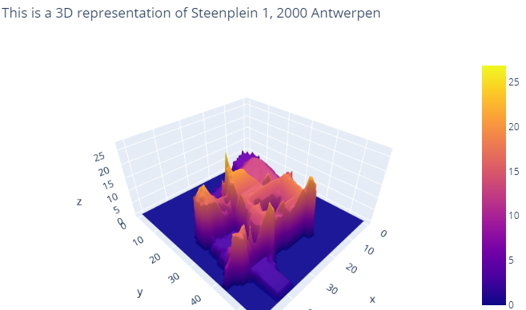

# 3D House Project

- Developer Name : `Arlene Postrado`
- Level: `Junior Developer`
- Duration: `2 weeks`
- Deadline: `25/02/2021 H:17h00`
- Team challenge : `Solo`
- Type of Challenge: `Learning and Consolidation`
- Deployment Strategy: `Github page | Powerpoint | Jupyter Notebook | Webpage | App`
- Promotion: `AI Theano 2`
- Coding Bootcamp: `Becode  Artificial Intelligence (AI) Bootcamp`

## Mission Objectives
- Consolidate the knowledge in Python specifically in `Numpy, Pandas` and `Matplotlib`

## Learning Objectives
- Learn how to search and implement new libraries
- Learn how to read and use shapefiles
- Learn how to read and use geoTIFFs
- Learn how to render a 3D plot
- Learn how to present a final product

## About the Repository

This is a project about searching an address in Vlaanderen and then it will return a 3D representation of the address using the `LIDAR` method.

`Digital Surface Map (DSM)` and `Digital Terrain Map (DTM)` are already computed and available from www.geopunt.be. We just incorporated it to the python code to be able to plot a certain address and then get the 3D representation of that address.

### Definitions

`LIDAR` is a method to measure distance using light. The device will illuminate a target with a laser light and a sensor will measure the reflection. Differences in wavelenght and return times will be used to get the 3D representations of an area. 

`Digital Surface Model (DSM)` includes ground surface, vegetation and man-made objects. DSM demonstrate the natural and artificial features on the Earth’s surface. DSM may be useful for RF planning, landscape modelling, city modelling, visualization applications and more.

`Digital Terrain Model (DTM)` is often required for flood or ground rupture modeling, land-use studies, geological analysis DSM demonstrate the natural and artificial features on the Earth’s surface.

## Repository
 
 This repository has 2 versions namely:

### Python Notebook version
- If you want to use the notebook version to run the code, all you need is the **3D_houses.ipynb** and the **data** folder to run the code.
- To run the code, you need to input the address that you want and run all the cells to get a 3D representation of the address.

### Python File version
- If you want to use the python file version to run the code, you need the **program.py**, the **utils** folder and the **data** folder to run the code.
- To run the code, you need to only run the `program.py` and enter the address that you want to get a 3D representation of the address.

**README.md**
  - has all the necessary information regarding the project

**3D_houses.ipynb**
  - this is the notebook version of the code, if you wish to have only the notebook to run the code it is possible with this code.
  - all you need to do is to use this notebook and the data folder and the code will work and plot the 3D for you

**program.py**
  - this is where you start the program
  - everything that you need to the program is imported here 
  - when you run this program it will ask you to input a Vlaanderen address and then it will start the program and plot a 3D representation of the address for you

**utils folder**
  - this has 2 files namely:
      1. **api.py**
          - this is where all the API requests are
          - this is where we send the requests to the API to get the details of the address like the coordinates and the polygon

      2. **geotiff.py**
          - this contains all the functions regarding the geotiff files
          - here is where it will get the tiff files, create the masked tiff file and also get the CHM (Canopy Height Model) from the DSM(Digital Surface Model) and DTM (Digital Terrain Model)
      

**data folder**
  - this has 4 files namely:
      1. **3D-images folder**
          - this is where all 3D images are saved as a PNG file

      2. **masked-files folder**
          - this is where all the masked files are saved

      3. **temp-raster folder**
          - this is where the tiff files are extracted and saved temporarily, once the program was able to create the masked files, it will then delete the files inside this folder to save storage and memory

      2. **bounding-box.csv**
          - this is a CSV file containing all the bounding box of the DSM file
          - we will use this csv to figure out which tiff file the address belongs to

    

## Clone/Fork Repository
  - If you wish to clone/fork this repository, you can just click on the repository, then click the Clone/fork button and follow the instructions.

## Pending...
 - The program takes too long to load because it is downloading the tiff file from the website, still trying to optimize that part of the code.

  
### Thank you for reading. Have fun!
